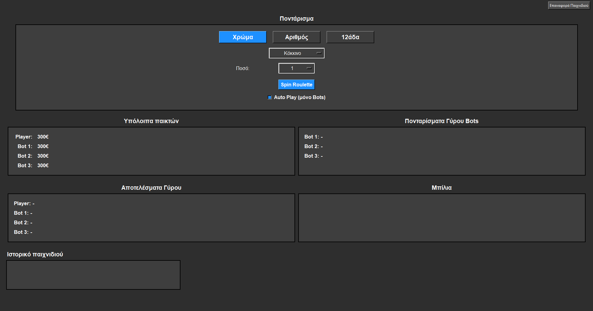

# Python Roulette Game

A desktop roulette game built with Python and Tkinter, featuring player betting, computer-controlled bots, balance management, betting history, and Auto Play mode.

## Features

- Graphical user interface (GUI)
- European roulette (0–36)
- Player betting system
- Betting on:
  - Numbers
  - Colors
  - Dozens
- Three computer-controlled bots
- Automatic bot betting
- Player and bot balances
- Round results and betting history
- Auto Play mode
- Dark-themed interface

## Gameplay

The player starts with a balance of 300 credits and can place bets on:

- A specific number (0–36)
- Red or Black
- One of the three dozens

Three computer-controlled bots place their own bets automatically.

After the bets are placed, the roulette wheel spins and the results are displayed.

The game also includes an Auto Play mode for automatic rounds.

## Technologies

- Python
- Tkinter
- Random module

## How to Run

1. Make sure Python 3 is installed.
2. Download or clone this repository.
3. Run the following command:

```bash
python roulette_game.py
```

## Screenshot



## Project

This project demonstrates practical use of Python programming concepts, including:

- GUI development with Tkinter
- Variables and data structures
- Functions and modular programming
- Conditional logic
- Random number generation
- Event-driven programming
- Game state and balance management

## Author

Spyros Plakoutsis
